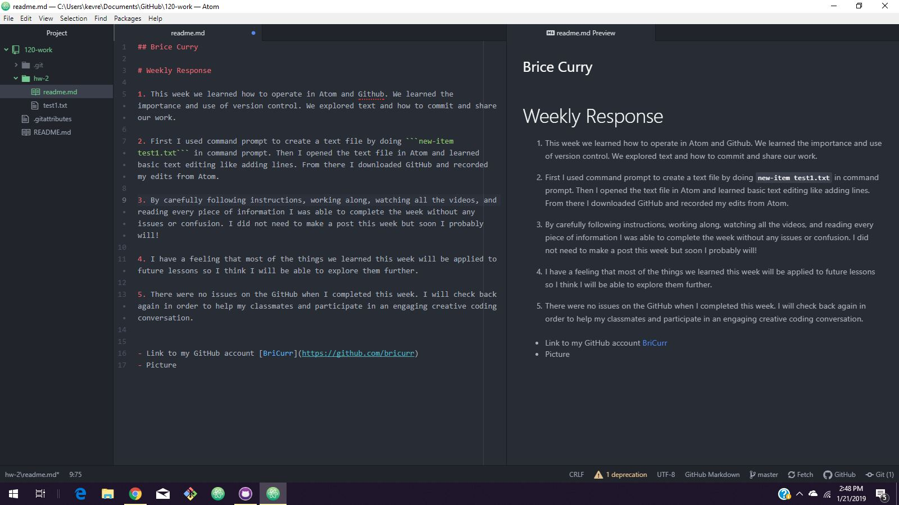

## Brice Curry

# Weekly Response

1. This week we learned how to operate in Atom and Github. We learned the importance and use of version control. We explored text and how to commit and share our work.

2. First I used command prompt to create a text file by doing ```new-item test1.txt```. Then I opened the text file in Atom and learned basic text editing like adding lines. From there I downloaded GitHub and recorded my edits from Atom and make commits.

3. By carefully following instructions, working along, watching all the videos, and reading every piece of information I was able to complete the week without any issues or confusion. I did not need to make a post this week but soon I probably will!

4. I have a feeling that most of the things we learned this week will be applied to future lessons so I think I will be able to explore them further.

5. There were no issues on the GitHub when I completed this week. I will check back again in order to help my classmates and participate in an engaging creative coding conversation.


- Link to my GitHub account [BriCurr](https://github.com/bricurr)
- Screenshot 
