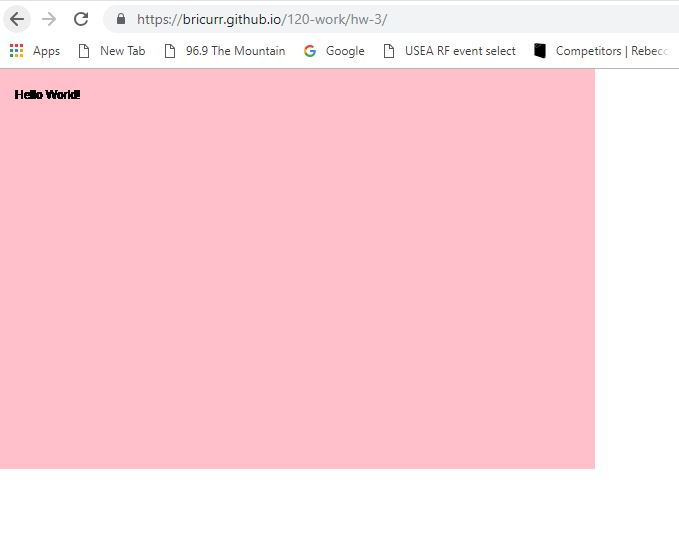

# Brice Curry

["Hello World!" Sketch](https://bricurr.github.io/120-work/hw-3/)

## Weekly Response

### Summary
The most important aspect of this week was creating a P5 sketch. To do this I had to use a function or piece of code that preforms a specific task. We started with a Hello World program then used setup and draw functions to create a canvas and a background. This week I learned about inline and block comments which make it easy to keep track of work within code. HTML also played a major role as it took my sketch from Atom to an actual web based site.

### Steps
Building off of my prior steps helped create this week's project as a whole. I had to do things like create the canvas first in order to color it. Learning function parameters and key words played a major role in completing and following along in my P5 sketch. I utilized skills from the last lesson when I made my GitHub go live.

### Issues
This week went fairly well for me as I once again followed along closely. I made sure to watch all the videos and read any recommended articles. I had a minor issue getting my HW-3 repository live, but I had forgotten to make my final commits. Once I went back and reviewed I was able to continue.

### Future weeks
I am interested in learning more p5.js commands and how to use them but I am sure we will cover that in the weeks that follow. I also checked the issue board but was not able to answer any of the questions. As time goes on I hope to be knowledgeable enough to assist my peers.

### Screenshot of Sketch

