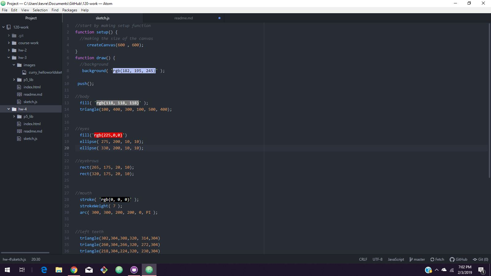

# Brice Curry

[Monster Sketch](https://bricurr.github.io/120-work/hw-4/)

## Weekly Response

### Summary
This week the focus was on creating an image sketch with p5.js code. This meant coding out shapes and putting them together. I chose to do a monster sketch. The important aspects of this week where how to properly create each shape on a grid canvas. We had to know x,y, dimensions and color. We learned how to manipulate the shapes in order to do things like rotate and scale.

### Steps
I found myself looking through the reference many times during this week. I had to figure out where to put the numbers in order to alter things like the width and height of shapes. I did a physical sketch of my monster on graph paper also and I did a bit of math to figure out how to get every detail perfect. I used comments within Atom in order to keep track of what part I was working on.

### Issues
I had some issues understanding the Unit Circle as it can be difficult to wrap my head around. I had no problem remembering steps from previous weeks. The order of operations tripped me up from time to time but I just had to go back and review my code.

### Future weeks
I am slightly worried about remembering specific code for the following weeks. I like that we will be doing more with our drawings and I am excited to animate it.

### Screenshot of Atom

